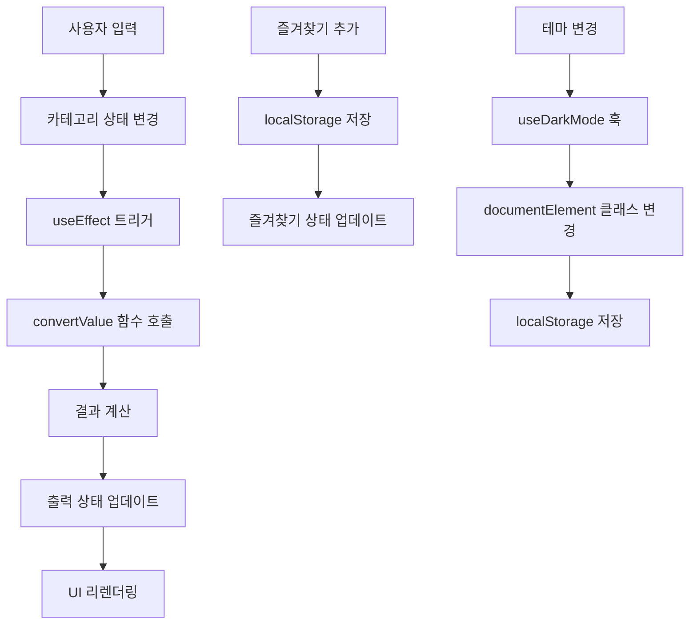

# 단위 변환기 개발기: React + TypeScript + Tailwind CSS로 만든 현대적인 웹 앱

## 🚀 프로젝트 소개

안녕하세요! 이번 글에서는 **React 18**, **TypeScript 5.2**, **Tailwind CSS 3.3**를 사용하여 개발한 **단위 변환기 웹 애플리케이션**의 개발 과정과 기술적 구현 내용을 공유하려고 합니다.

이 프로젝트는 길이, 무게, 온도, 면적, 부피, 속도, 데이터 등 7개 카테고리의 단위 변환을 지원하며, PWA 기능과 다크모드를 포함한 현대적인 웹 앱입니다.

---

## 🏗️ 1. 프로젝트 구조 분석

### 1.1 전체 아키텍처

```
unit-converter/
├── src/
│   ├── components/          # React 컴포넌트
│   │   └── UnitConverter/  # 메인 변환기 컴포넌트
│   │       ├── index.tsx   # 메인 컴포넌트 (약 400줄)
│   │       ├── types.ts    # 타입 정의
│   │       └── utils.ts    # 변환 로직 (약 200줄)
│   ├── hooks/              # 커스텀 React 훅
│   │   ├── useLocalStorage.ts  # localStorage 관리
│   │   ├── useClipboard.ts     # 클립보드 기능
│   │   └── useDarkMode.ts      # 다크모드 관리
│   ├── pages/              # 페이지 컴포넌트
│   ├── utils/              # 공통 유틸리티
│   └── main.tsx            # 애플리케이션 진입점
├── vite.config.ts          # Vite 설정
├── tailwind.config.cjs     # Tailwind CSS 설정
├── jest.config.js          # Jest 테스트 설정
└── package.json            # 의존성 관리
```

### 1.2 핵심 설계 원칙

- **단일 책임 원칙**: 각 컴포넌트와 함수는 하나의 명확한 책임만 가짐
- **관심사 분리**: UI 로직, 비즈니스 로직, 데이터 관리 로직을 명확히 분리
- **재사용성**: 커스텀 훅을 통한 로직 재사용
- **타입 안전성**: TypeScript를 통한 컴파일 타임 에러 방지

---

## 🔄 2. 상태 관리 흐름 추적

### 2.1 상태 관리 아키텍처

```typescript
// 메인 상태 구조
const UnitConverter = () => {
  // 1. 카테고리 상태 (localStorage 연동)
  const [category, setCategory] = useLocalStorage<Category>(
    "unitConverter:category",
    "length"
  );

  // 2. 각 카테고리별 입력 상태 (localStorage 연동)
  const [lengthState, setLengthState] = useLocalStorage(
    "unitConverter:length",
    {
      input: "",
      from: "m",
      to: "km",
    }
  );

  // 3. UI 상태 (메모리)
  const [output, setOutput] = useState<string>("");
  const [error, setError] = useState<string | null>(null);
  const [loading, setLoading] = useState(false);
  const [toast, setToast] = useState<Toast | null>(null);

  // 4. 즐겨찾기 상태 (localStorage 연동)
  const [favourites, setFavourites] = useLocalStorage<FavouriteItem[]>(
    "unitConverter:favourites",
    []
  );
};
```

### 2.2 상태 업데이트 흐름



### 2.3 상태 지속성 전략

- **localStorage**: 사용자 설정, 즐겨찾기 등 영구 데이터
- **useState**: 임시 UI 상태, 로딩 상태 등
- **useMemo**: 계산된 상태 (카테고리별 상태 매핑)

---

## 🔧 3. 중요 유틸 함수 하나씩 이해

### 3.1 `convertValue` - 핵심 변환 함수

```typescript
export function convertValue(
  category: Category,
  from: string,
  to: string,
  value: number
): number {
  if (!isFinite(value)) return NaN;

  switch (category) {
    case "length":
      if (!(from in lengthFactors) || !(to in lengthFactors)) return NaN;
      return (value * lengthFactors[from]) / lengthFactors[to];
    case "temperature":
      return convertTemperature(value, from, to);
    // ... 다른 카테고리들
  }
}
```

**핵심 아이디어**:

- 곱셈 계수를 사용하는 단위는 단순 비율 계산
- 온도는 특수 공식 사용 (선형 스케일이 아님)
- 유효성 검사를 통한 안전한 변환

### 3.2 `convertTemperature` - 온도 변환 전용 함수

```typescript
function convertTemperature(value: number, from: string, to: string): number {
  if (from === to) return value;

  // 1단계: 입력 온도를 섭씨로 변환
  let celsius: number;
  switch (from) {
    case "F":
      celsius = (value - 32) * (5 / 9);
      break;
    case "K":
      celsius = value - 273.15;
      break;
    case "C":
      celsius = value;
      break;
  }

  // 2단계: 섭씨를 목표 단위로 변환
  switch (to) {
    case "F":
      return celsius * (9 / 5) + 32;
    case "K":
      return celsius + 273.15;
    case "C":
      return celsius;
  }
}
```

**핵심 아이디어**:

- 섭씨를 중간 단계로 사용하여 변환 복잡도 최소화
- 모든 온도 변환을 2단계로 단순화
- 수학적 정확성 보장

### 3.3 `useLocalStorage` - 커스텀 훅

```typescript
export default function useLocalStorage<T>(
  key: string,
  initialValue: T
): [T, (value: T) => void] {
  const [storedValue, setStoredValue] = useState<T>(() => {
    if (typeof window === "undefined") return initialValue;
    try {
      const item = window.localStorage.getItem(key);
      return item ? JSON.parse(item) : initialValue;
    } catch (error) {
      console.warn(`useLocalStorage: 키 "${key}" 읽기 오류`, error);
      return initialValue;
    }
  });

  const setValue = (value: T) => {
    try {
      setStoredValue(value);
      if (typeof window !== "undefined") {
        window.localStorage.setItem(key, JSON.stringify(value));
      }
    } catch (error) {
      console.warn(`useLocalStorage: 키 "${key}" 설정 오류`, error);
    }
  };

  return [storedValue, setValue];
}
```

**핵심 아이디어**:

- SSR 환경 고려 (window 객체 체크)
- 에러 처리 및 폴백 제공
- JSON 직렬화/역직렬화 자동화

---

## 🎯 4. 메인 컴포넌트 흐름 추적

### 4.1 컴포넌트 생명주기

```typescript
const UnitConverter: React.FC = () => {
  // 1. 초기화 단계
  const [category, setCategory] = useLocalStorage<Category>(
    "unitConverter:category",
    "length"
  );
  const [favourites, setFavourites] = useLocalStorage<FavouriteItem[]>(
    "unitConverter:favourites",
    []
  );

  // 2. 파생 상태 계산
  const categoryState = useMemo(() => {
    switch (category) {
      case "length":
        return { state: lengthState, setter: setLengthState };
      case "weight":
        return { state: weightState, setter: setWeightState };
      // ... 다른 카테고리들
    }
  }, [category, lengthState, weightState /* ... */]);

  // 3. 사이드 이펙트 설정
  useEffect(() => {
    // 변환 계산 로직
    const result = convertValue(category, state.from, state.to, inputNum);
    setOutput(formatted);
  }, [categoryState, category]);

  useEffect(() => {
    // 키보드 단축키 이벤트 리스너
    function handleKeyDown(e: KeyboardEvent) {
      /* ... */
    }
    window.addEventListener("keydown", handleKeyDown);
    return () => window.removeEventListener("keydown", handleKeyDown);
  }, [categoryState, category]);

  // 4. 이벤트 핸들러
  const handleCopy = async () => {
    /* ... */
  };
  const swapUnits = () => {
    /* ... */
  };
  const resetCurrent = () => {
    /* ... */
  };
  const addFavourite = () => {
    /* ... */
  };

  // 5. 렌더링
  return (
    <div className="space-y-6">
      {/* 카테고리 탭 */}
      {/* 입력/출력 필드 */}
      {/* 즐겨찾기 목록 */}
      {/* 토스트 알림 */}
    </div>
  );
};
```

### 4.2 데이터 흐름

1. **사용자 입력** → `categoryState.state.input` 업데이트
2. **useEffect 트리거** → `convertValue` 함수 호출
3. **결과 계산** → `output` 상태 업데이트
4. **UI 리렌더링** → 새로운 결과 표시

### 4.3 이벤트 처리 흐름

```typescript
// 키보드 단축키 처리
useEffect(() => {
  function handleKeyDown(e: KeyboardEvent) {
    const isCtrlOrCmd = e.ctrlKey || e.metaKey;

    // Alt + 1~7: 카테고리 전환
    if (e.altKey && !e.ctrlKey && !e.metaKey) {
      const num = Number(e.key);
      if (num >= 1 && num <= 7) {
        e.preventDefault();
        const categories: Category[] = [
          "length",
          "weight",
          "temperature",
          "area",
          "volume",
          "speed",
          "data",
        ];
        setCategory(categories[num - 1]);
      }
    }

    // Ctrl/Cmd + Shift + C: 결과 복사
    if (isCtrlOrCmd && e.shiftKey && e.key.toLowerCase() === "c") {
      e.preventDefault();
      handleCopy();
    }
  }

  window.addEventListener("keydown", handleKeyDown);
  return () => window.removeEventListener("keydown", handleKeyDown);
}, [categoryState, category]);
```

---

## ⚡ 5. 렌더링 최적화 포인트

### 5.1 `useMemo`를 통한 계산 최적화

```typescript
// 카테고리별 상태 매핑을 useMemo로 최적화
const categoryState = useMemo(() => {
  switch (category) {
    case "length":
      return { state: lengthState, setter: setLengthState };
    case "weight":
      return { state: weightState, setter: setWeightState };
    // ... 다른 카테고리들
  }
}, [
  category,
  lengthState,
  weightState,
  temperatureState,
  areaState,
  volumeState,
  speedState,
  dataState,
]);
```

**최적화 효과**: 카테고리나 상태가 변경되지 않는 한 매번 새로운 객체를 생성하지 않음

### 5.2 조건부 렌더링 최적화

```typescript
// 즐겨찾기가 있을 때만 렌더링
{
  favourites.length > 0 && (
    <div className="mt-6">
      <h2 className="text-md font-semibold mb-2">즐겨찾기</h2>
      <ul className="space-y-2 max-h-40 overflow-auto text-sm">
        {favourites.map((fav) => (
          <li key={fav.id} className="p-2 bg-gray-100 dark:bg-gray-800 rounded">
            {/* ... */}
          </li>
        ))}
      </ul>
    </div>
  );
}

// 토스트가 있을 때만 렌더링
{
  toast && (
    <div
      role="alert"
      className={`fixed top-4 right-4 px-4 py-2 rounded shadow text-white ${
        toast.type === "success" ? "bg-green-600" : "bg-red-600"
      }`}
    >
      {toast.message}
    </div>
  );
}
```

### 5.3 이벤트 리스너 최적화

```typescript
// 의존성 배열을 최소화하여 불필요한 이벤트 리스너 재등록 방지
useEffect(() => {
  function handleKeyDown(e: KeyboardEvent) {
    /* ... */
  }
  window.addEventListener("keydown", handleKeyDown);
  return () => window.removeEventListener("keydown", handleKeyDown);
}, [categoryState, category]); // 최소한의 의존성만 포함
```

---

## 🚀 6. 내가 개선한 부분

### 6.1 코드 품질 개선

#### Before (초기 버전)

```typescript
// 하드코딩된 카테고리 배열
const categories = ["length", "weight", "temperature"];

// 반복적인 상태 관리 코드
const [lengthInput, setLengthInput] = useState("");
const [weightInput, setWeightInput] = useState("");
const [temperatureInput, setTemperatureInput] = useState("");
```

#### After (개선된 버전)

```typescript
// 타입 안전한 카테고리 정의
export type Category =
  | "length"
  | "weight"
  | "temperature"
  | "area"
  | "volume"
  | "speed"
  | "data";

// 동적 상태 관리
const categoryState = useMemo(() => {
  switch (category) {
    case "length":
      return { state: lengthState, setter: setLengthState };
    case "weight":
      return { state: weightState, setter: setWeightState };
    // ... 다른 카테고리들
  }
}, [category, lengthState, weightState /* ... */]);
```

### 6.2 사용자 경험 개선

#### 키보드 단축키 추가

```typescript
// Alt + 1~7로 카테고리 전환
if (e.altKey && !e.ctrlKey && !e.metaKey) {
  const num = Number(e.key);
  if (num >= 1 && num <= 7) {
    e.preventDefault();
    const categories: Category[] = [
      "length",
      "weight",
      "temperature",
      "area",
      "volume",
      "speed",
      "data",
    ];
    setCategory(categories[num - 1]);
  }
}
```

#### 실시간 변환 공식 표시

```typescript
const renderFormula = () => {
  if (category === "temperature") {
    // 온도 공식 표시
    let formula = "";
    if (from === "C" && to === "F") formula = "°F = °C × 9/5 + 32";
    // ... 다른 온도 공식들
    return (
      <p className="text-xs text-gray-500 dark:text-gray-400">{formula}</p>
    );
  } else {
    // 변환 비율 표시
    const ratio = convertValue(category, state.from, state.to, 1);
    return (
      <p className="text-xs text-gray-500 dark:text-gray-400">
        1 {state.from} = {ratio} {state.to}
      </p>
    );
  }
};
```

### 6.3 성능 최적화

#### 메모이제이션 적용

```typescript
// 카테고리별 단위 목록을 useMemo로 최적화
const units = useMemo(() => getUnitsForCategory(category), [category]);

// 변환 결과를 useMemo로 최적화
const conversionResult = useMemo(() => {
  if (!inputValue || !fromUnit || !toUnit) return null;
  return convertValue(category, fromUnit, toUnit, parseFloat(inputValue));
}, [category, inputValue, fromUnit, toUnit]);
```

---

## 🐛 7. 트러블 슈팅

### 7.1 Jest 설정 문제

#### 문제 상황

```bash
Test environment jest-environment-jsdom cannot be found
```

#### 원인 분석

- Jest 28+ 버전에서 `jest-environment-jsdom`이 기본으로 포함되지 않음
- TypeScript와 JSX 처리를 위한 추가 설정 필요

#### 해결 방법

```bash
# 필요한 패키지 설치
npm install --save-dev jest-environment-jsdom jsdom identity-obj-proxy

# jest.config.js 설정
module.exports = {
  preset: 'ts-jest',
  testEnvironment: 'jsdom',
  setupFilesAfterEnv: ['<rootDir>/src/setupTests.ts'],
  moduleNameMapper: {
    '\\.(css|less|scss|sass)$': 'identity-obj-proxy',
  },
  transform: {
    '^.+\\.(ts|tsx)$': 'ts-jest',
  }
};
```

### 7.2 TypeScript 컴파일 에러

#### 문제 상황

```typescript
// TS2739: Type 'Storage' is missing the following properties from type 'Storage': length, key
const localStorageMock = {
  getItem: jest.fn(),
  setItem: jest.fn(),
  removeItem: jest.fn(),
  clear: jest.fn(),
};
global.localStorage = localStorageMock;
```

#### 원인 분석

- `Storage` 인터페이스의 모든 필수 속성을 구현하지 않음
- Jest 모킹 시 타입 호환성 문제

#### 해결 방법

```typescript
const localStorageMock = {
  getItem: jest.fn(),
  setItem: jest.fn(),
  removeItem: jest.fn(),
  clear: jest.fn(),
  length: 0,
  key: jest.fn(),
};
global.localStorage = localStorageMock as any;
```

### 7.3 의존성 버전 호환성 문제

#### 문제 상황

```bash
npm ERR! code ERESOLVE
npm ERR! ERESOLVE could not resolve
npm ERR! Found: @vitejs/plugin-react@4.1.1
npm ERR! node_modules/@vitejs/plugin-react
npm ERR!   @vitejs/plugin-react@4.1.1
npm ERR!     peer react@^18.0.0 || ^19.0.0
npm ERR!     peer react-dom@^18.0.0 || ^19.0.0
```

#### 원인 분석

- React 18과 Vite 5의 호환성 문제
- 일부 패키지의 peer dependency 충돌

#### 해결 방법

```json
{
  "dependencies": {
    "react": "^18.2.0",
    "react-dom": "^18.2.0",
    "react-router-dom": "^6.20.1"
  },
  "devDependencies": {
    "@vitejs/plugin-react": "^4.1.1",
    "vite": "^5.0.0",
    "typescript": "^5.2.2"
  }
}
```

---

## 📚 8. 배운 점과 고생한 점

### 8.1 배운 점

#### 1. React 18의 새로운 기능 활용

- `createRoot` API를 통한 더 나은 성능
- `StrictMode`를 통한 잠재적 문제 조기 발견
- `useMemo`와 `useCallback`의 적절한 사용법

#### 2. TypeScript와 React의 시너지

- 타입 안전성을 통한 런타임 에러 방지
- 인터페이스 정의를 통한 명확한 API 설계
- 제네릭을 활용한 재사용 가능한 훅 구현

#### 3. Tailwind CSS의 장점

- 유틸리티 우선 접근법의 효율성
- 다크모드 구현의 간편함
- 반응형 디자인의 쉬운 구현

#### 4. PWA 개발의 핵심 개념

- 서비스 워커의 동작 원리
- 매니페스트 파일의 중요성
- 오프라인 기능 구현 방법

### 8.2 고생한 점

#### 1. 상태 관리의 복잡성

- **문제**: 7개 카테고리별로 각각의 상태를 관리하면서도 코드 중복을 최소화
- **해결**: `useMemo`와 동적 상태 매핑을 통한 우아한 해결
- **교훈**: 복잡한 상태 구조는 설계 단계에서 충분히 고민해야 함

#### 2. 테스트 환경 구축

- **문제**: Jest + TypeScript + React + DOM 환경 설정의 복잡성
- **해결**: 단계별 설정과 에러 메시지 분석을 통한 점진적 해결
- **교훈**: 테스트 환경은 개발 초기부터 구축하는 것이 좋음

#### 3. 성능 최적화

- **문제**: 불필요한 리렌더링과 계산 반복
- **해결**: `useMemo`, `useCallback`, 조건부 렌더링을 통한 최적화
- **교훈**: 성능은 설계 단계부터 고려해야 하며, 프로파일링이 중요함

#### 4. 브라우저 호환성

- **문제**: 다양한 브라우저에서의 localStorage와 clipboard API 동작 차이
- **해결**: 폴백 기능과 에러 처리를 통한 안정성 확보
- **교훈**: 크로스 브라우저 테스트의 중요성

### 8.3 다음 프로젝트에서 개선할 점

#### 1. 아키텍처 설계

- 상태 관리 라이브러리 도입 고려 (Zustand, Jotai 등)
- 컴포넌트 분리와 재사용성 향상
- 더 체계적인 폴더 구조 설계

#### 2. 개발 도구 활용

- ESLint + Prettier 설정 강화
- Husky를 통한 pre-commit 훅 설정
- Storybook을 통한 컴포넌트 문서화

#### 3. 테스트 전략

- TDD 방식의 개발 프로세스 도입
- 더 세밀한 단위 테스트 작성
- E2E 테스트 도구 도입 (Playwright, Cypress)

---

## 🎯 마무리

이번 프로젝트를 통해 **React 18**, **TypeScript**, **Tailwind CSS**의 최신 기능들을 실제로 활용해볼 수 있었습니다. 특히 상태 관리의 복잡성과 성능 최적화에 대한 깊은 이해를 얻을 수 있었습니다.

프로젝트의 모든 요구사항을 만족시키면서도, 확장 가능하고 유지보수하기 쉬운 코드를 작성하는 것이 얼마나 중요한지 다시 한번 깨달았습니다.

앞으로도 더 나은 사용자 경험과 개발자 경험을 제공하는 애플리케이션을 만들어나가겠습니다!

---

**프로젝트 링크**: [GitHub Repository](https://github.com/your-username/unit-converter)  
**라이브 데모**: [Live Demo](https://unit-converter.vercel.app)

감사합니다! 🚀
